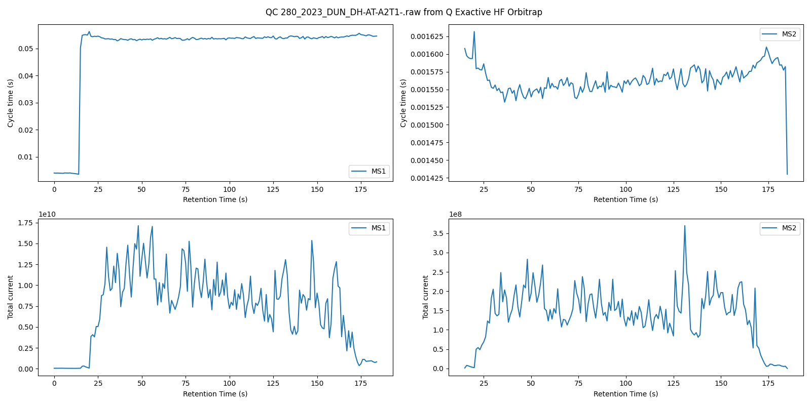

# Raw QC
## A quick way to QC raw files from Themo 



<br>
The app produces a plot that visualizes the total ion current and cycle time vs the retention time
<br>

---

# Running the Docker App
The `mtinti/raw_qc` Docker container provides a convenient solution for accessing Thermo Fisher Scientific's RAW files on Linux systems. Leveraging the [ThermoFisher Scientific RawFileReader](https://github.com/thermofisherlsms/RawFileReader/) library and the Mono framework, this containerized application offers a seamless way to interact with and process RAW file data without the need for native Windows dependencies. 

This guide will walk you through the steps needed to run the `raw_qc` Docker application on your local machine. <br>
This app processes RAW files and requires you to provide a path to the RAW file you wish to process.

## Prerequisites

- Docker installed on your local machine. <br>
If you don't have Docker installed, follow the installation instructions for your platform on the [Docker website](https://docs.docker.com/get-docker/).

## Step 1: Pull the Docker Image

Open a terminal and pull the `mtinti/raw_qc` image from Docker Hub:

```sh
docker pull mtinti/raw_qc
```

## Step 2: Prepare Your Data

Ensure that the RAW file you want to process is accessible on your local machine. <br>
Note the full path to the directory containing this file, as you will need it in the next step.

## Step 3: Run the Docker Container

Use the `docker run` command to start a container from the `mtinti/raw_qc` image. <br>
You'll need to mount the directory containing your RAW file to the container and specify the path to the RAW file inside the container.

- Replace `/path/to/local/directory` with the full path to the directory on your host machine that contains the RAW file. <br>
- Replace `your_raw_file.raw` with the name of your RAW file.

```sh
docker run --rm -v /path/to/local/directory:/data mtinti/raw_qc /data/your_raw_file.raw
```

This command will process the specified RAW file and output the results. The `--rm` flag ensures that the container is automatically removed after it exits, keeping your system clean.

## Step 4: Accessing the Results

The output files will be saved in the same directory as your input RAW file on your local machine.

## Troubleshooting

- For problems related to the `mtinti/raw_qc`, please submit an issue in the GitHub repository.


